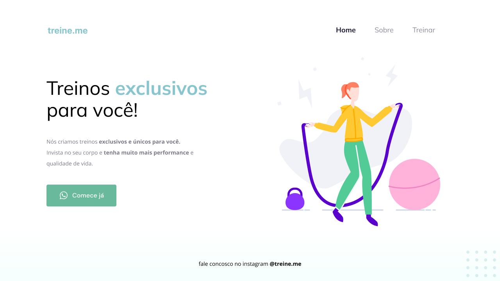

<h1 align="center"> Treine.me </h1>

Estudo introdutório de HTML e CSS. 

  <a href="#-tecnologias">Tecnologias</a>&nbsp;&nbsp;&nbsp;|&nbsp;&nbsp;&nbsp;
  <a href="#-projeto">Projeto</a>&nbsp;&nbsp;&nbsp;|&nbsp;&nbsp;&nbsp;
  <a href="#memo-licença">Licença</a>

  

 

  

## 🚀 Tecnologias

Esse projeto foi desenvolvido com as seguintes tecnologias:

- HTML e CSS
- Figma

## 💻 Projeto

Esse projeto foi construido utilizando os conceitos inicias de HTML e CSS durante o curso do explorer da Rocketseat.

- [Acesse o projeto finalizado, online](https://robsonlopesjr.github.io/rocketseat-explorer-treineme/)

## :memo: Licença

Esse projeto está sob a licença MIT.

---

Feito com ♥ by Robson :wave: [Contato](https://www.linkedin.com/in/robsonlopesjr/)
